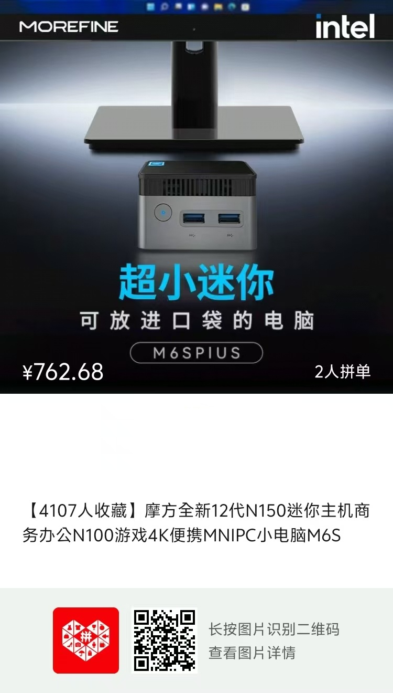
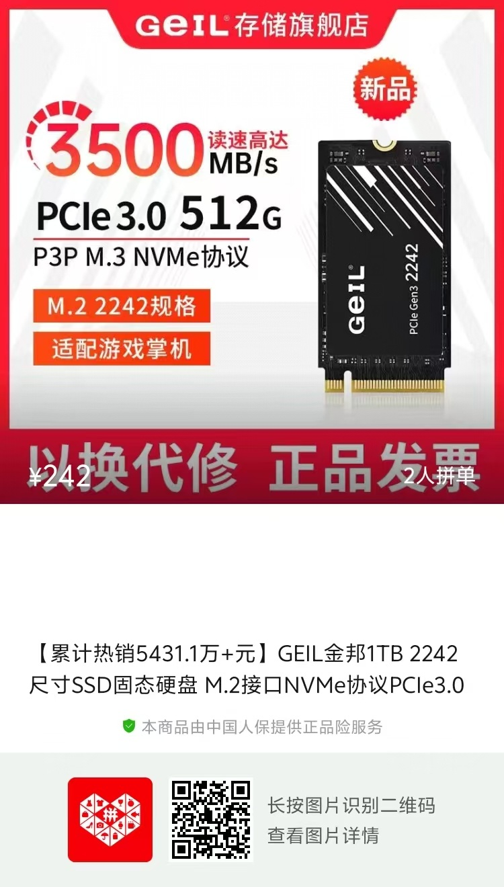
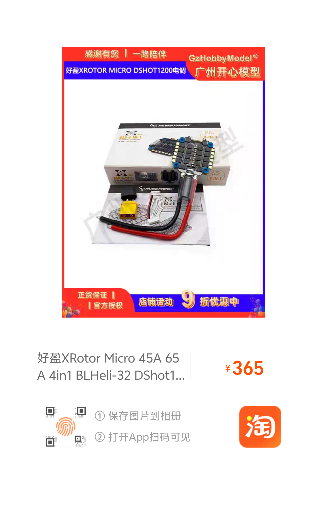
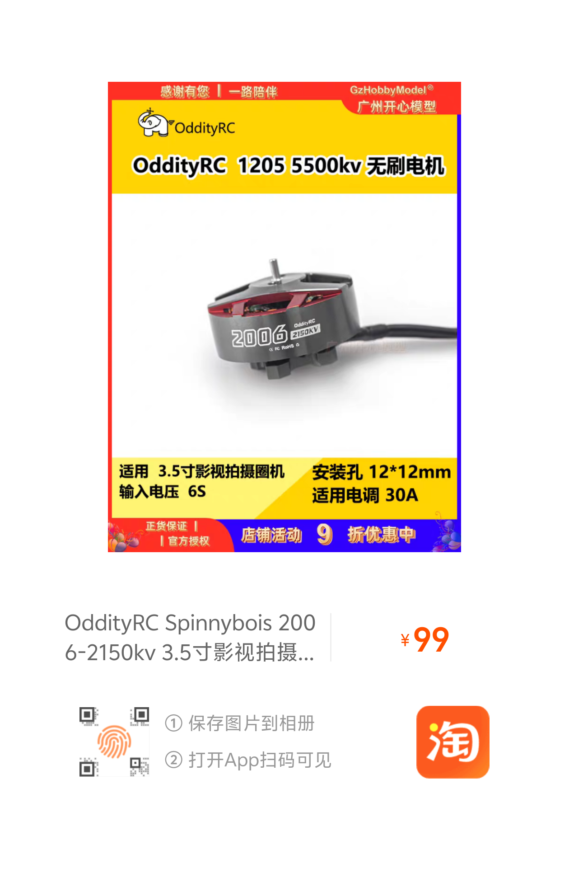
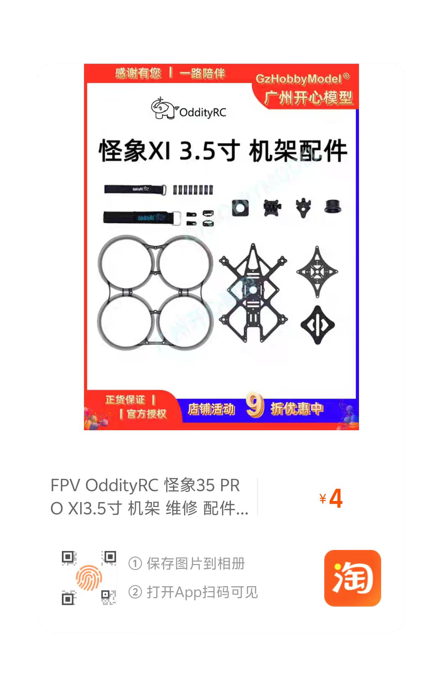
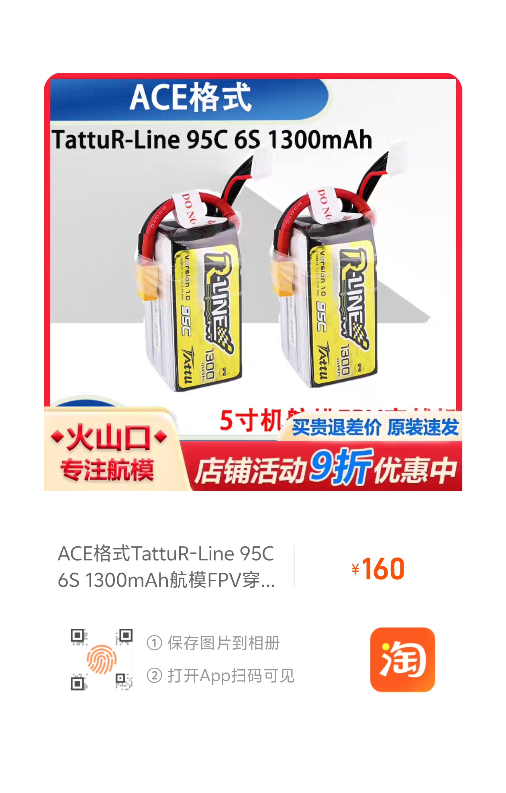
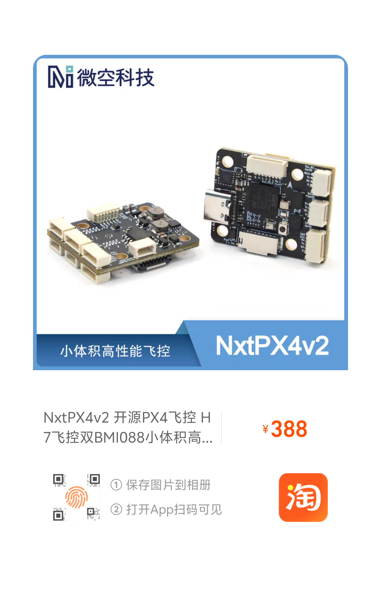

# 硬件组装说明文档

⚠️ 注意：请严格按照步骤操作，做好绝缘防护，做好设备检查点，以避免飞控、电调等设备因高电压而烧毁！

## 硬件选型

### 选型思路

参考 [YOPO 项目](https://github.com/your-org/your-hardware-selection-guide) 的思路，我们选择了 怪象-35 这一市面上成熟的穿越机作为硬件搭载平台，选取摩方 M6S N150 迷你主机作为算力平台。

这一套硬件平台具有成本低、小型化、长续航、灵活性好的优点，美中不足的是，N150迷你主机虽然以整机+内存+硬盘 1000不到的低成本实现了 egoplanner 的搭载运算，但是N150那4核4线程，低主频和纯E核架构的孱弱算力还是决定了它不适合更为复杂的运算任务，升级和拓展潜力受限。如果能找到体积相似，但是搭载了 AMD 四核八线程移动端处理器的迷你主机，得益于 AMD 的先进制程优势，运算能力将会提升不少。

### 硬件列表

#### 主要硬件（单架飞机）

| 硬件名称         | 图片           | 价格      | 备注               |
|------------------|:--------------:|:---------:|--------------------|
| D435 双目相机   |  | ￥960    |  咸鱼当时购买参考价 ，带票        |
| 摩方 M6S N150 迷你主机    |  | ￥804     | 迷你主机，自带WIFI模块和 12GB LPDDR5 内存  |
| 金邦 M.2 2242 规格 512G 固态硬盘       |  | ￥195    | 飞行控制器          |
| 电调 4合1 45A 好盈    |  | ￥365     |             |
| 无刷电机    |  | ￥320   | 4个合计价格             |
| 桨叶保护圈          |  | ￥60     | 含            |
| 飞机碳板     |  | ￥175     | 需定制，相关配件在YOPO项目中有，中间四孔位需改为M3规格            |
| 6S 锂电池  |  | ￥135     | 建议多备几块        |
| H7飞控         |  | ￥388    | 支持刷PX4固件           |
| 机架配件          |  | ￥200     | 螺丝、支架等        |

⭐ 提示：电子产品价格存在涨落，也会受到活动/叠券之类操作影响最终到手价格，请以实际为准！

#### 生产设备（供参考）

#### 杂项（小零件/可复用）

## 组装步骤

